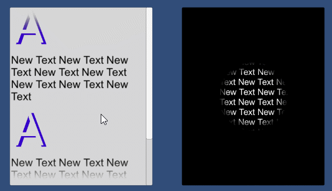

基于UGUI的SoftMask组件，通过SoftMask的alpha贴图控制目标元素的显示区域。可有效避免使用Mask时产生的硬边，并可以实现更多的效果。详情请运行示例工程`SceneTest`。

---

A SoftMask component based on UGUI, which can modify the appearance of masked objects with the assigned alpha texture. With SoftMask the hard cut caused by Mask can be avoided easily and you can create some more effects. For details please run `SceneTest`.